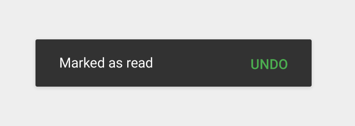

# React Native Snackbar

[](https://travis-ci.org/cooperka/react-native-snackbar)
[](https://www.npmjs.com/package/react-native-snackbar)
[](https://www.npmjs.com/package/react-native-snackbar)
[](https://github.com/cooperka/react-native-snackbar)

Material Design "Snackbar" component for Android and iOS.
Supports custom colors, fonts, and languages.



Snackbars are used for displaying a brief message to the user, along with an optional action.
They animate up from the bottom of the screen and then disappear shortly afterward.

See Google's [Material Design guidelines](https://material.io/guidelines/components/snackbars-toasts.html) for more info on Snackbars
and when to use them.

## How it works

```js
Snackbar.show({
  text: 'Hello world',
  duration: Snackbar.LENGTH_SHORT,
});
```

Or, to include an action button:

```js
Snackbar.show({
  text: 'Hello world',
  duration: Snackbar.LENGTH_INDEFINITE,
  action: {
    text: 'UNDO',
    textColor: 'green',
    onPress: () => { /* Do something. */ },
  },
});
```

## Installation

1. Install:
    - Using [npm](https://www.npmjs.com/#getting-started): `npm install react-native-snackbar --save`
    - Using [Yarn](https://yarnpkg.com/): `yarn add react-native-snackbar`

2. [Link](https://facebook.github.io/react-native/docs/linking-libraries-ios.html):
    - RN >= 0.60 supports [autolinking](https://github.com/react-native-community/cli/blob/master/docs/autolinking.md): first `cd ios && pod install && cd ..`
    - RN < 0.60: `react-native link react-native-snackbar`
    - Or if that fails, link manually using [these steps](https://github.com/cooperka/react-native-snackbar/wiki/Manual-Installation)
    - Note that because this is a native module, Expo does not support it -- to use with Expo you need to [eject to ExpoKit](https://docs.expo.io/versions/latest/expokit/eject/)

3. Import it in your JS:

    ```js
    import Snackbar from 'react-native-snackbar';
    ```

## Usage

### Snackbar.show(options)

Shows a Snackbar, dismissing any existing Snackbar first. Accepts an object with the following options:

| Key | Data type | Default value? | Description |
|-----|-----------|----------------|-------------|
| `text` | `string` | Required. | The message to show. |
| `duration` | See below | `Snackbar.LENGTH_SHORT` | How long to display the Snackbar. |
| `numberOfLines` | `number` | `2` | The max number of text lines to allow before ellipsizing. |
| `marginBottom` | `number` | `0` | Margin from bottom. |
| `textColor` | `string` or `style` | `'white'` | The color of the message text. |
| `backgroundColor` | `string` or `style` | `undefined` (dark gray) | The background color for the whole Snackbar. |
| `fontFamily` | `string` | `undefined` | [Android only] The basename of a `.ttf` font from `assets/fonts/` (see [setup guide](https://github.com/facebook/react-native/issues/25852) and [example app](/example), remember to `react-native link` after). |
| `rtl` | `boolean` | `false` | [Android only, API 17+] Whether the Snackbar should render right-to-left (requires `android:supportsRtl="true"`, see [setup guide](https://android-developers.googleblog.com/2013/03/native-rtl-support-in-android-42.html) and [example app](/example)). |
| `action` | `object` (described below) | `undefined` (no button) | Optional config for the action button (described below). |

Where `duration` can be one of the following (timing may vary based on device):

- `Snackbar.LENGTH_SHORT` (just over a second)
- `Snackbar.LENGTH_LONG` (about three seconds)
- `Snackbar.LENGTH_INDEFINITE` (stays on screen until dismissed, replaced, or action button is tapped)

The optional `action` object can contain the following options:

| Key | Data type | Default value? | Description |
|-----|-----------|----------------|-------------|
| `text` | `string` | Required. | The button text. |
| `textColor` | `string` or `style` | `'white'` | The color of the button text. |
| `onPress` | `function` | `undefined` (Snackbar is simply dismissed) | A callback for when the user taps the button. |

Deprecation note: The old keys `title` and `color` have been replaced by `text` and `textColor` for consistency.
The old keys will continue to work for now but are deprecated and may be removed at any time.

### Snackbar.dismiss()

Dismisses any existing Snackbars.

## Troubleshooting

#### Snackbar not appearing [Android]

The Snackbar is designed to attach to whatever view is on top of your screen when `show` is called. If that view happens to be a temporary alert modal or some other view that goes away, you'll never see the Snackbar.

A workaround in some cases is to use `setTimeout` to show the Snackbar a few seconds later after the modal is gone. See [issue #28](https://github.com/cooperka/react-native-snackbar/issues/28) for further discussion. If you want to submit a PR to improve the view-finding logic, feel free.

#### Undefined import

If you see errors similar to `Cannot read property 'LENGTH_LONG' of undefined` or `Undefined not an object (NativeModules.RNSnackbar)`, please refer to [issue #43](https://github.com/cooperka/react-native-snackbar/issues/43) for help.

#### Compiling [Android]

If you have issues compiling for Android after linking this library,
please try updating your Gradle and Android configs to the latest versions. For example:

In your `android/build.gradle`:

- `com.android.tools.build:gradle:3.4.1` (or higher)

In your `android/app/build.gradle`:

- `compileSdkVersion 28` (or higher)
- `buildToolsVersion "28.0.3"` (or higher)

#### Compiling [iOS]

Make sure your Deployment Target is iOS 9.0 or above.

## Software development

If you want to help contribute to this library, here are local setup steps:

1. Clone this git repo
1. Install main dependencies: `yarn install`
1. Set up the example app too: `cd example && yarn install`
1. Within the example directory, `react-native run-android` to run it

The example app will update automatically when changing JS code. To see your changes in the example app after updating native library code, reinstall it via:

1. `yarn add file:.. && react-native run-android` in the example directory
1. Type "rr" in the app to trigger a reload
